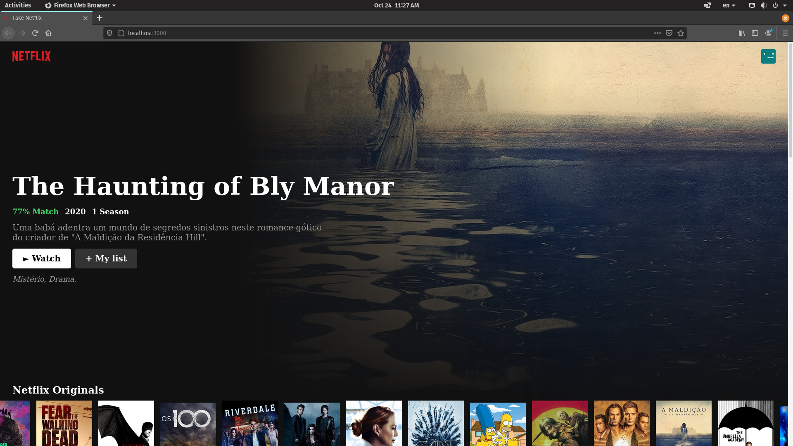

# Netflix User Interface Clone

## Brief
This project is a user interface clone from Netflix using ReactJS.

The project was created for educational purposes. All image rights are owned by Netflix.

Data extracted from [TMDB](https://www.themoviedb.org/documentation/api).

This project was bootstrapped with [Create React App](https://github.com/facebook/create-react-app).

#### Preview


#### Screenshot




___

## 1 - How to create the project
In the terminal type the follow command to create a `YOUR_PROJECT_NAME` project :

```
$ npx create-react-app YOUR_PROJECT_NAME
```

To start the project:

```
$ cd YOUR_PROJECT_NAME
$ npm start
```

___

## 2 - Hidden your API Key

### 2.1 - Create a file called `.env` in the root of the project directory.

```
.
├── .env
├── .gitignore
├── node_modules
├── package.json
├── public
├── README.md
├── src
└── yarn.lock
```

### 2.2 - Put your key in the `.env` file.

- The `create-react-app` tool uses `REACT_APP_` to identify variables. So put `REACT_APP_` to your API Key.

```
// REACT_APP_WEATHER_API_KEY=your_api_key
// Example:
REACT_APP_WEATHER_API_KEY=123456
```

- In the file `.js`, to access the variable use:

```
process.env.REACT_APP_WEATHER_API_KEY;
```

## 3 - Install icons from Material-UI

```
$ npm install @material-ui/core
$ npm install @material-ui/icons
```
___

## 4 - Available Scripts

In the project directory, you can run:

### `yarn start`

Runs the app in the development mode.<br />
Open [http://localhost:3000](http://localhost:3000) to view it in the browser.

The page will reload if you make edits.<br />
You will also see any lint errors in the console.

### `yarn test`

Launches the test runner in the interactive watch mode.<br />
See the section about [running tests](https://facebook.github.io/create-react-app/docs/running-tests) for more information.

### `yarn build`

Builds the app for production to the `build` folder.<br />
It correctly bundles React in production mode and optimizes the build for the best performance.

The build is minified and the filenames include the hashes.<br />
Your app is ready to be deployed!

See the section about [deployment](https://facebook.github.io/create-react-app/docs/deployment) for more information.

### `yarn eject`

**Note: this is a one-way operation. Once you `eject`, you can’t go back!**

If you aren’t satisfied with the build tool and configuration choices, you can `eject` at any time. This command will remove the single build dependency from your project.

Instead, it will copy all the configuration files and the transitive dependencies (webpack, Babel, ESLint, etc) right into your project so you have full control over them. All of the commands except `eject` will still work, but they will point to the copied scripts so you can tweak them. At this point you’re on your own.

You don’t have to ever use `eject`. The curated feature set is suitable for small and middle deployments, and you shouldn’t feel obligated to use this feature. However we understand that this tool wouldn’t be useful if you couldn’t customize it when you are ready for it.

___